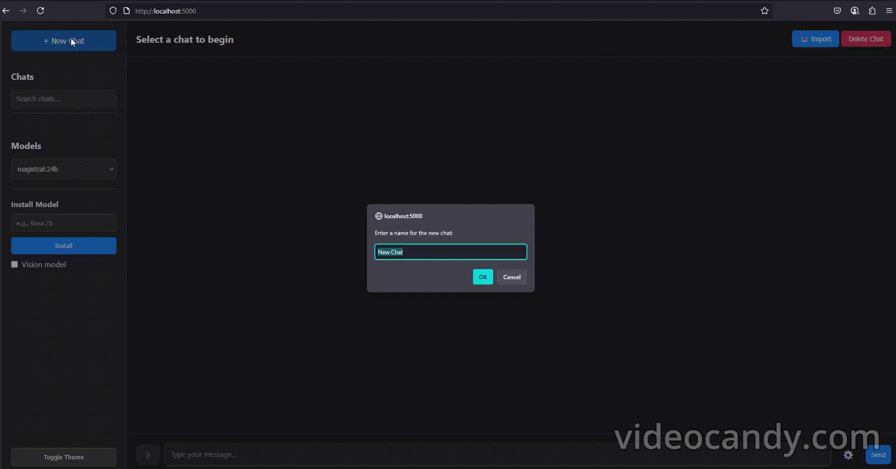

# ModelVerse: AI Chat Interface

Fuse and manage multiple local AI models in one place. Your Ultimate Platforme to use all Ollama Models on your local machine

## Demo

### Chat Interface
<p align="center">
  
</p>

### Model Management
<p align="center">
  
</p>

## About The Project

ModelVerse is a full-stack web application that provides a clean, feature-rich user interface for interacting with local large language models (LLMs) and vision models through Ollama.

This project was built as a learning tool for students and developers interested in:

- **Full-Stack Development**: See how a Python Flask backend communicates with a vanilla JavaScript frontend.
- **AI Integration**: Learn how to stream responses from local AI models and manage different model capabilities.
- **Real-Time Communication**: Understand the use of WebSockets (via Flask-SocketIO) for live progress bars and chat.
- **Database Persistence**: See how SQLite can be used to store and retrieve chat history.
- **Handling File Uploads**: Learn how to manage and serve user-uploaded images for vision models.

## Key Features

ModelVerse comes packed with features that make interacting with local AI models a seamless experience:

- **Multi-Model Chat**: Seamlessly switch between any model installed in your Ollama instance.
- **Model Management**: Install new models directly from the web interface with a real-time progress bar.
- **Persistent Conversations**: All your chats are saved in a local SQLite database, so you never lose your history.
- **Chat Management**:
  - Create, name, and delete chat sessions.
  - Switch between multiple conversations.
  - Search your entire chat history by title.
  - Import the context from one chat into another.
- **Multimodal Support (Vision)**:
  - Tag models as "vision-capable" during installation.
  - Upload images to chat with vision models like LLaVA or Moondream.
  - The image upload button is intelligently enabled only when a vision model is active.
- **Fine-Grained Control**:
  - Adjust model parameters like Temperature and Top P to control creativity and randomness.
  - Settings are saved per-browser for a consistent experience.
- **Modern UI/UX**:
  - A clean, responsive interface.
  - A toggleable Light/Dark theme.
  - Markdown rendering for assistant responses with syntax highlighting for code blocks.
  - "Copy code" button for easy code snippets management.

## Technology Stack

- **Backend**:
  - Python 3
  - Flask: A lightweight web framework for the API.
  - Flask-SocketIO: For real-time communication.
  - Requests: For communicating with the Ollama API.

- **Frontend**:
  - HTML5
  - CSS3
  - Vanilla JavaScript: No frontend frameworks needed.

- **AI Engine**:
  - Ollama: For running and managing local LLMs.

- **Database**:
  - SQLite: For simple, file-based database persistence.

## Getting Started

Follow these instructions to get a local copy up and running.

### Prerequisites

Before you begin, you must have Docker and Docker Compose installed on your machine.

- [Install Docker](https://docs.docker.com/get-docker/)
- [Install Docker Compose](https://docs.docker.com/compose/install/)

### Running with Docker Compose

This is the recommended way to run the application.

#### Clone the Repository

```sh
git clone https://github.com/cherifsid/ModelVerse.git
cd ModelVerse

# Rebuild the services
docker-compose build --no-cache

# Start the services in the background
docker-compose up -d
# Watch the backend logs for model download progress
docker logs -f ollama-chat-backend
```

Wait for the model pulling to complete. Once you see the Flask server running, you can proceed.

Access ModelVerse
Open your web browser and navigate to:

http://localhost:5000